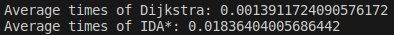
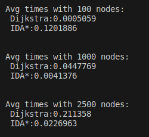

## Kattavuus:

# Testaus

## Mitä testattu?

- Molempia algoritmeja, jotta ne palauttavat testiverkosta oikean lyhimmmän polun. Dijkstralla myös solmujen oikeat etäisyydet.

- Kekoa/prioriteettijonoa, jotta tästä saadaan aina pienin arvo ulos.

## Toistettavuus

- Testit toimivat automaattisilla yksikkötesteillä.

- Ohjelma tuottaa suoritettaessa graafisen verkon, jossa solmujen väliset painot on laskettu niiden euklidisen etäisyyden perusteella. Empiirisesti voidaan katsoa, että algoritmi löytää oikean lyhimmän reitin kahden solmun välillä, jos sellainen polku löytyy.

## Suorituskyky

Suorituskyvyn testausta on tehty muutamilla erilaisilla verkoilla sekä automaattisesti että empiirisesti kokeilemalla.

Ensin on testattu Dijkstran ja IDA*:in suorituskykyä satunnaisesti generoidulla verkolla jonka solmujen aste on noin 5. Maalisolmu on haettu mahdollisimman kaukaa lähtösolmusta, jotta nähdään, miten IDA suoriutuu verkossa, jossa kaarien määrä on suhteellisen suuri. Kuvasta nähdään, että Dijkstra suoriutuu paremmin.

Toiseksi on ohjelman sisäisellä automaattisella testillä toteutettu vertailu. Verkko on täysin satunnainen eli solmut ja niiden väliset kaaret on sattumanvaraisia. Lopputuloksena on usein verkko jonka solmujen väliset polut ovat suhteellisen lyhyitä. Pienemmillä solmumäärillä Dijkstra suorituu paremmin, mutta solmujen määrän kasvaessa IDA*:in heuristiikkafunktio ohjaa polun hakua oikeampaan suuntaan välttäen turhien solmujen läpikäymisen. Verkoilla, joiden solmujen aste on pieni ja/tai kaaret vievät polkua väärään suuntaan, hidastavat nopeasti IDA*:in suorituskykyä.
